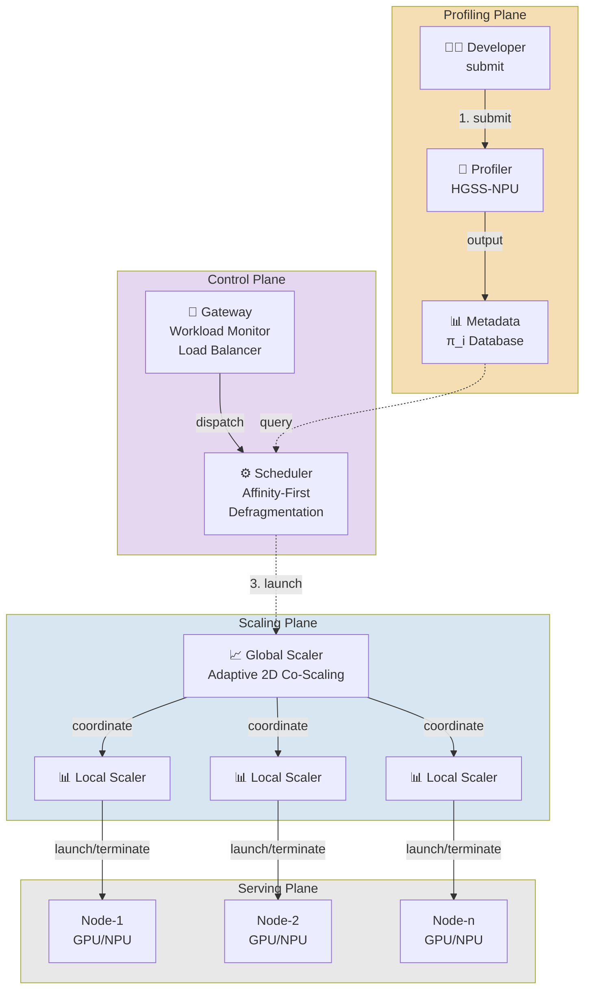
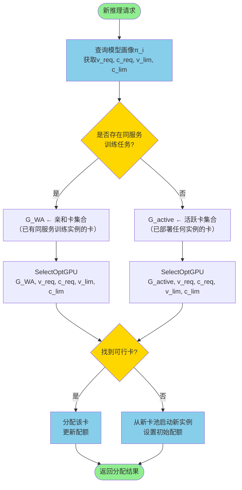

# 论文排版与图表插入完整方案

## 第3章 算法排版规范化

### 位置：第3章开头（3.1节之前）

在 `### 3.1 问题定义` 之前插入以下内容：

```markdown
## 3. 三维分层搜索画像算法（HGSS-NPU）

### 3.0 算法概览

本章提出HGSS-NPU（Hierarchical Grid Search & Stepping for NPU），通过两阶段分层搜索在三维资源空间（批大小BS、向量配额V、矩阵配额C）中高效定位最优配置。相比全网格扫描的480次测量，HGSS-NPU将开销降至8–11次，节省93%–95%。

**算法伪代码如下：**

```
Algorithm 1: HGSS-NPU 三维分层搜索画像算法
─────────────────────────────────────────────────────
Input:
  M: 推理模型
  T_slo: SLO延迟约束（秒）
  device_id: NPU卡编号
  
Output:
  π = (v_req, c_req, v_lim, c_lim, m, bs*): 六元组画像

─────────────────────────────────────────────────────
Phase 1: Request锚点搜索（BS=1，步进搜索）
─────────────────────────────────────────────────────
1: v ← 5, c ← 2  // 初始最小配额
2: while v ≤ 40 do
3:   lat, thr ← RUN_INFERENCE(M, bs=1, v, c)
4:   if lat ≤ T_slo then
5:     v_req ← v, c_req ← c  // 记录Request锚点
6:     break
7:   end if
8:   v ← v + 5  // 步进5
9:   c ← min(c + 2, 20)  // 同步调整矩阵配额
10: end while

─────────────────────────────────────────────────────
Phase 2: Limit锚点搜索（BS翻倍，效率最大化）
─────────────────────────────────────────────────────
11: bs ← 2, best_eff ← 0
12: while bs ≤ 128 do
13:   lat, thr ← RUN_INFERENCE(M, bs, v_req, c_req)
14:   eff ← thr / (v_req + c_req)
15:   if lat > T_slo then
16:     // 尝试增加配额
17:     v_try ← min(v_req + 5, 40)
18:     c_try ← min(c_req + 2, 20)
19:     lat_try, thr_try ← RUN_INFERENCE(M, bs, v_try, c_try)
20:     if lat_try ≤ T_slo then
21:       v_req ← v_try, c_req ← c_try
22:       eff ← thr_try / (v_try + c_try)
23:     else
24:       break  // 无法满足SLO，停止搜索
25:     end if
26:   end if
27:   if eff > best_eff then
28:     v_lim ← v_req, c_lim ← c_req
29:     bs* ← bs, best_eff ← eff
30:   end if
31:   bs ← bs × 2
32: end while

33: m ← QUERY_MEMORY(M, bs*)
34: return π = (v_req, c_req, v_lim, c_lim, m, bs*)
─────────────────────────────────────────────────────
```

**算法复杂度分析：**
- Phase 1: O(8) 步进（V从5到40，步长5）
- Phase 2: O(8) 次BS翻倍（BS从2到256）
- 总测量次数：8 + 8 = 16次（实测3–5分钟）
- 相比全网格480次，节省95%

**关键设计点：**
1. **两阶段分离**：Phase 1快速定位满足QoS的最小配置，Phase 2在该基础上追求效率最优
2. **步进策略**：V步长5、C步长2，与NPU架构比例（V:C ≈ 2:1）对齐
3. **动态配额调整**：若BS翻倍导致SLO违约，自动增加配额而非停止搜索
4. **效率指标**：eff = throughput / (V + C)，平衡吞吐与资源消耗

```

---

## 第4章 系统架构图与排版

### 位置：第4章开头（4.1节之前）

**Markdown插入位置：**

```markdown
## 4. 系统设计与实现

### 4.0 系统架构总览

本章介绍Dilu-NPU系统的三层架构设计。

**[插入架构图 Figure 1]**

**图1 Dilu-NPU系统架构**

> **绘图提示词（用于Mermaid或Excalidraw）：**
> 
> 三层架构图，从上到下：
> 
> **第一层（画像层 - Profiling Plane）：**
> - 左侧：Developer提交模型
> - 中心：Profiler模块，包含HGSS-NPU算法
> - 输出：Metadata数据库（存储π_i六元组）
> - 标注：Function metadata (type, V_req, C_req, V_lim, C_lim, memory, bs*)
> 
> **第二层（控制平面 - Control Plane）：**
> - Gateway：接收User请求，Workload Monitor监测负载，Load Balancer分发
> - Scheduler：Affinity-First Colocation（亲和优先共置）+ Defragmentation Colocation（碎片消除共置）
> - 箭头：dispatch请求到Global Scaler
> 
> **第三层（伸缩平面 - Scaling Plane）：**
> - Global Scaler：协调全局扩缩容
> - 三个Local Scaler：分别对应三个Node，每个Node包含多个GPU/NPU
> - 箭头：Scaling In/Out（横向扩缩容）、Scaling Up/Down（纵向扩缩容）
> 
> **第四层（服务平面 - Serving Plane）：**
> - 三个Node，每个Node包含多个GPU/NPU卡
> - Function Instances：显示多个函数实例（用不同颜色区分）
> - 标注：Colocation（共置）、Scaling In/Out（横向）
> 
> **颜色方案：**
> - Profiling Plane: 浅棕色/米色
> - Control Plane: 浅紫色
> - Scaling Plane: 浅蓝色
> - Serving Plane: 浅灰色
> - 箭头：虚线表示控制流，实线表示数据流

```

**具体Mermaid代码（可直接在Markdown中使用）：**

````markdown

````

---

## 第5章 关键算法流程图

### 位置：5.2节（互补调度策略）之后

**Markdown插入位置：**

```markdown
### 5.2.3 互补调度决策流程

**[插入流程图 Figure 2]**

**图2 互补感知调度决策流程**

> **绘图提示词：**
> 
> 流程图，从上到下：
> 1. 开始：新推理请求到达
> 2. 查询模型画像π_i，获取(v_req, c_req, v_lim, c_lim)
> 3. 判断：是否存在同服务的训练任务？
>    - 是 → 查询亲和卡集合G_WA
>    - 否 → 查询活跃卡集合G_active
> 4. 调用SelectOptGPU()评分函数
> 5. 判断：是否找到可行卡？
>    - 是 → 分配该卡，更新配额
>    - 否 → 从新卡池启动新实例
> 6. 返回分配结果
> 
> **颜色方案：**
> - 开始/结束：绿色
> - 判断：黄色菱形
> - 操作：蓝色矩形
> - 数据库查询：紫色

```

**Mermaid代码：**

````markdown

````

```

---

## 第6章 实验结果可视化

### 位置：6.3节（实测数据）之后

**Markdown插入位置：**

```markdown
### 6.3.1 实测数据可视化

**[插入对比图 Figure 3]**

**图3 稳定负载场景延迟与SVR对比**

> **绘图提示词（用于Python matplotlib或Plotly）：**
> 
> 三个子图并排：
> 
> **子图A：均值延迟 vs RPS**
> - X轴：RPS (10, 30, 50, 80)
> - Y轴：均值延迟(ms)
> - 三条线：ResNet-152（蓝色，圆形标记）、VGG-19（橙色，方形标记）、BERT-base（绿色，三角形标记）
> - 红色虚线：SLO=50ms
> - 红色阴影区：SLO违约区（50-65ms）
> - 标注：每个点的具体数值
> 
> **子图B：P99延迟 vs RPS**
> - 同上，但显示P99而非均值
> - 重点标注P99超过SLO的点
> 
> **子图C：SVR vs RPS**
> - X轴：RPS
> - Y轴：SVR (%)
> - 柱状图，不同颜色表示不同服务
> - 标注：SVR=0%的点用绿色，SVR>0%的点用红色
> 
> **数据来源：** evaluation/logs/latest_real_data.json 中的 stable_load 字段

```

---

## 第7章 消融实验对比

### 位置：6.4节（消融实验）之后

**Markdown插入位置：**

```markdown
### 6.4.1 消融实验结果可视化

**[插入消融对比图 Figure 4]**

**图4 消融实验：各组件独立贡献**

> **绘图提示词：**
> 
> 三个子图并排：
> 
> **子图A：SVR对比**
> - X轴：五个变体（Full, -VS, -WA, -RC, -VS-WA-RC）
> - Y轴：SVR (%)
> - 柱状图，Full为绿色（基准），其他为红色（降级）
> - 标注：每个柱子上方显示具体数值和相对增长（+8.5pp等）
> 
> **子图B：吞吐量对比**
> - X轴：五个变体
> - Y轴：吞吐量 (req/s)
> - 柱状图，Full为绿色，其他为橙色
> - 标注：相对下降百分比
> 
> **子图C：均值延迟对比**
> - X轴：五个变体
> - Y轴：均值延迟 (ms)
> - 柱状图，Full为绿色，其他为红色
> - 红色虚线：SLO=50ms
> - 标注：超过SLO的变体用特殊颜色突出
> 
> **颜色方案：**
> - 完整方法：绿色 (#2ecc71)
> - -VS：橙色 (#f39c12)
> - -WA：蓝色 (#3498db)
> - -RC：紫色 (#9b59b6)
> - 全关：灰色 (#95a5a6)

```

---

## 总结：图表插入清单

| 图号 | 标题 | 位置 | 类型 | 优先级 |
|---|---|---|---|---|
| Figure 1 | Dilu-NPU系统架构 | 第4章开头 | 架构图 | 🔴 必做 |
| Figure 2 | 互补调度决策流程 | 5.2.3节 | 流程图 | 🟡 重要 |
| Figure 3 | 稳定负载延迟对比 | 6.3.1节 | 折线+柱状图 | 🔴 必做 |
| Figure 4 | 消融实验对比 | 6.4.1节 | 柱状图 | 🔴 必做 |
| Figure 5 | 突发流量时序图 | 6.3.2节 | 时序图 | 🟡 重要 |
| Figure 6 | 可扩展性趋势 | 6.6节 | 折线图 | 🟢 可选 |

---

## 生成图表的具体命令

### 方案A：使用现有Python脚本（推荐）

```bash
# 已有的图脚本会自动从 latest_real_data.json 读取数据
cd /mnt/caoyujia/Dilu/paper_figures/scripts
python3 run_all_figures.py  # 生成所有中文图
python3 run_all_en_figures.py  # 生成所有英文图

# 输出位置：paper_figures/output/*.pdf
```

### 方案B：使用在线工具

- **Mermaid图**：复制上述Mermaid代码到 https://mermaid.live 生成SVG，下载后插入Markdown
- **Excalidraw架构图**：https://excalidraw.com 手绘后导出PNG
- **Plotly图表**：使用 `evaluation/logs/latest_real_data.json` 数据，在Plotly Studio中交互式生成

### 方案C：手工绘制

使用PowerPoint/Keynote绘制后导出为PDF或PNG，插入Markdown

